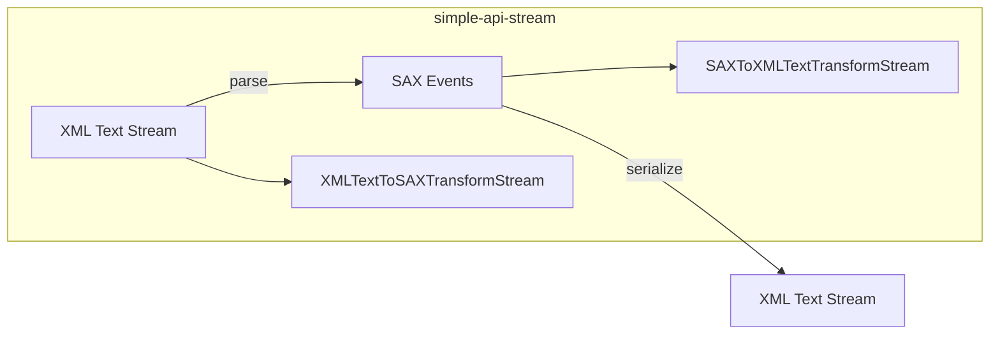

# simple-api-stream

**A lightweight, composable, SAX-based XML stream utility.**  
Built for modern JavaScript with full support for the Web Streams API and TypeScript.

> ✅ Version: `v1.0.0` (Stable Release)

---

## Features

- ✅ SAX-style XML parsing and emitting
- ✅ Stream-based input/output using the Web Streams API
- ✅ Supports:
  - Element start/end
  - Text content
  - CDATA sections
  - Comments
  - Processing instructions (`<?xml?>`, `<?xml-stylesheet?>`, etc.)
  - DOCTYPE declarations with internal subsets
- ✅ Converts between XML strings and SAX event objects
- ✅ Fully type-safe (TypeScript support)

---

## Installation

```bash
npm install simple-api-stream
```

## Usage
### 📥 Parse XML text into SAX events
```ts
import { SimpleSAXTransformStream } from "simple-api-stream";

const parser = new SimpleSAXTransformStream();

const xml = `<note><to>Tove</to><from>Jani</from></note>`;
const readable = new ReadableStream({
  start(controller) {
    controller.enqueue(xml);
    controller.close();
  },
});

for await (const event of readable.pipeThrough(parser)) {
  console.log(event);
}
```
### 📤 Generate XML from SAX events
```ts
import {
  ResolveToSAXReadableStream,
  SAXToXMLTextTransformStream,
} from "simple-api-stream";

const emitter = new ResolveToSAXReadableStream();
const serializer = new SAXToXMLTextTransformStream({
  indent: 2,
  lineBreak: "\n",
});

queueMicrotask(() => {
  emitter.startElement({ tagName: "message" });
  emitter.text({ text: "Hello, XML!" });
  emitter.endElement({ tagName: "message" });
  emitter.close();
});

for await (const chunk of emitter.pipeThrough(serializer)) {
  console.log(chunk);
}
```

## Components

### `XMLTextToSAXTransformStream`
Parses an XML string stream into SAX event objects.

```ts
new XMLTextToSAXTransformStream()
```
### `SAXToXMLTextTransformStream`
Converts SAX events back to a formatted XML string stream.

```ts
new SAXToXMLTextTransformStream({
  indent: 2,
  lineBreak: "\n",
})
```
### `ResolveToSAXReadableStream`
Imperatively emits SAX events into a readable stream.

```ts
const stream = new ResolveToSAXReadableStream();
stream.startElement({ tagName: "foo" });
stream.text({ text: "bar" });
stream.endElement({ tagName: "foo" });
stream.close();
```

## Event Types

Each event is structured as a plain object extending `xml.interfaces.SAXEventInterface`.

| Type | Description 
| - | -
| startElement | Opening tag and attributes
|endElement | Closing tag
| text | Text content
| cdata | CDATA section
|comment | Comment node
|processingInstruction | Processing instruction (e.g. `<?xml?>`)
| doctype | DOCTYPE with optional subset

## Example: Stream Pipeline

```ts
await readableXMLStream
  .pipeThrough(new XMLTextToSAXTransformStream())
  .pipeThrough(new SAXToXMLTextTransformStream({ indent: 2 }))
  .pipeTo(writableStreamToTextFile);
```

## Diagram (Optional Overview)


